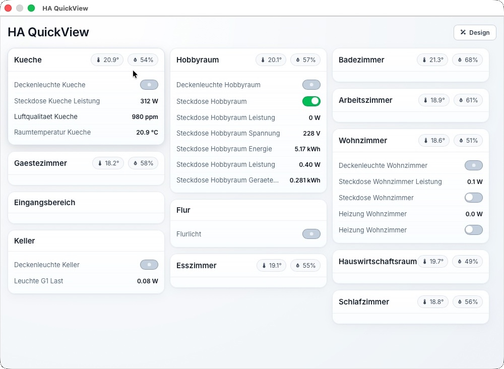
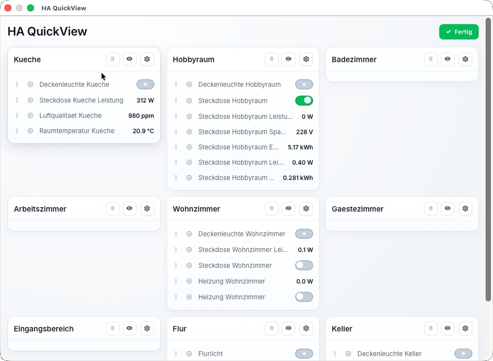
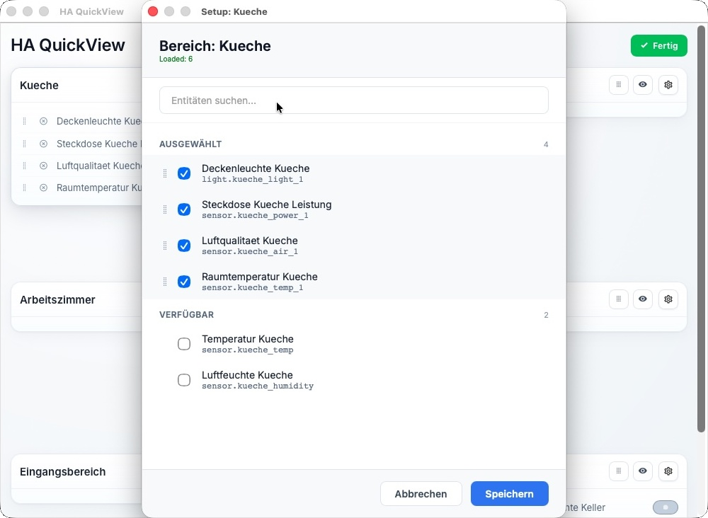

# HA QuickView

Dein schneller Überblick über Home Assistant auf dem Desktop.

## Navigation

- [Dokumentation](#dokumentation)
- [Screenshots](#screenshots)
- [Download](#download)
- [Lizenz](#lizenz)
- [Impressum](#impressum)

## Dokumentation

HA QuickView zeigt dir deine Home-Assistant-Räume in einer aufgeräumten Kartenansicht. Du siehst Temperatur und Luftfeuchte direkt pro Bereich und kannst Schalter sowie Lichter sofort bedienen. Im Design-Modus legst du fest, was sichtbar ist und in welcher Reihenfolge es erscheint.

1. App starten und mit deiner Home-Assistant-Instanz verbinden.
2. Mit `Design` in den Layout-Modus wechseln.
3. Räume per Drag-and-Drop so sortieren, wie du sie brauchst.
4. Entitäten auswählen, umsortieren oder ausblenden.
5. Mit `Fertig` speichern und die normale Ansicht nutzen.

## Screenshots

*Hauptansicht mit Bereichen, Sensoren und Schaltern.*

*Design-Modus zum Sortieren und Anpassen der Sichtbarkeit.*

*Einstellungsansicht zur Auswahl sichtbarer Entitäten.*

## Download

Alle veröffentlichten Versionen findest du auf GitHub:

[Zu den Releases](https://github.com/tuebben/ha-quickview/releases)

## Lizenz

Die App ist kostenlos für private und sonstige nicht-kommerzielle Nutzung.
Kommerzielle Nutzung ist ohne vorherige schriftliche Genehmigung nicht erlaubt.

Details: [LICENSE](./LICENSE)

## Impressum

- **Name:** Peter Tübben
- **Adresse:** Iltisweg 9, 26209 Hatten, Deutschland
- **E-Mail:** tuebben@gmail.com
- **Verantwortlich:** Peter Tübben
